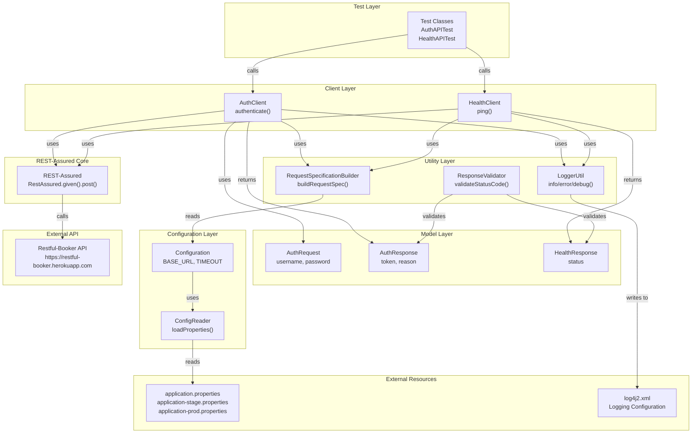
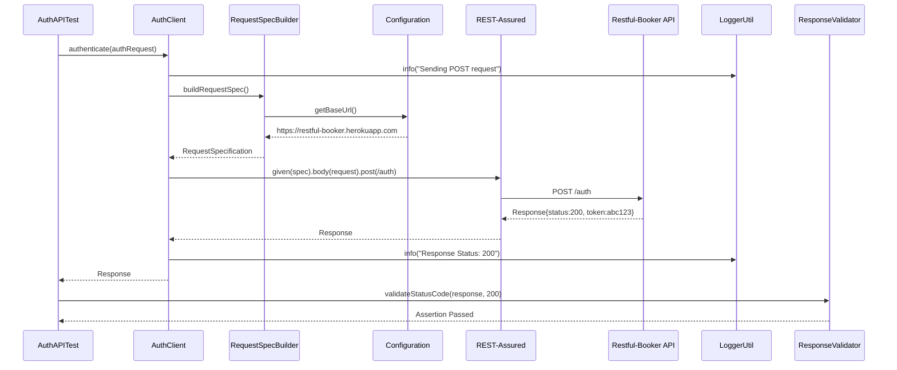
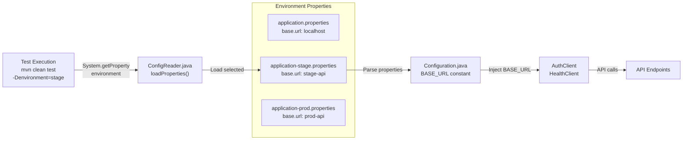
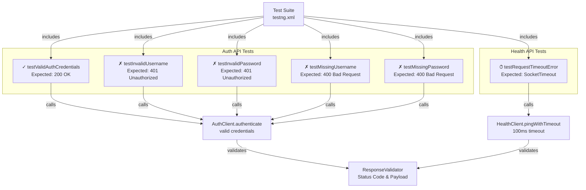
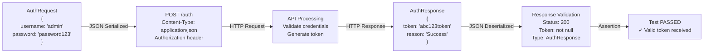
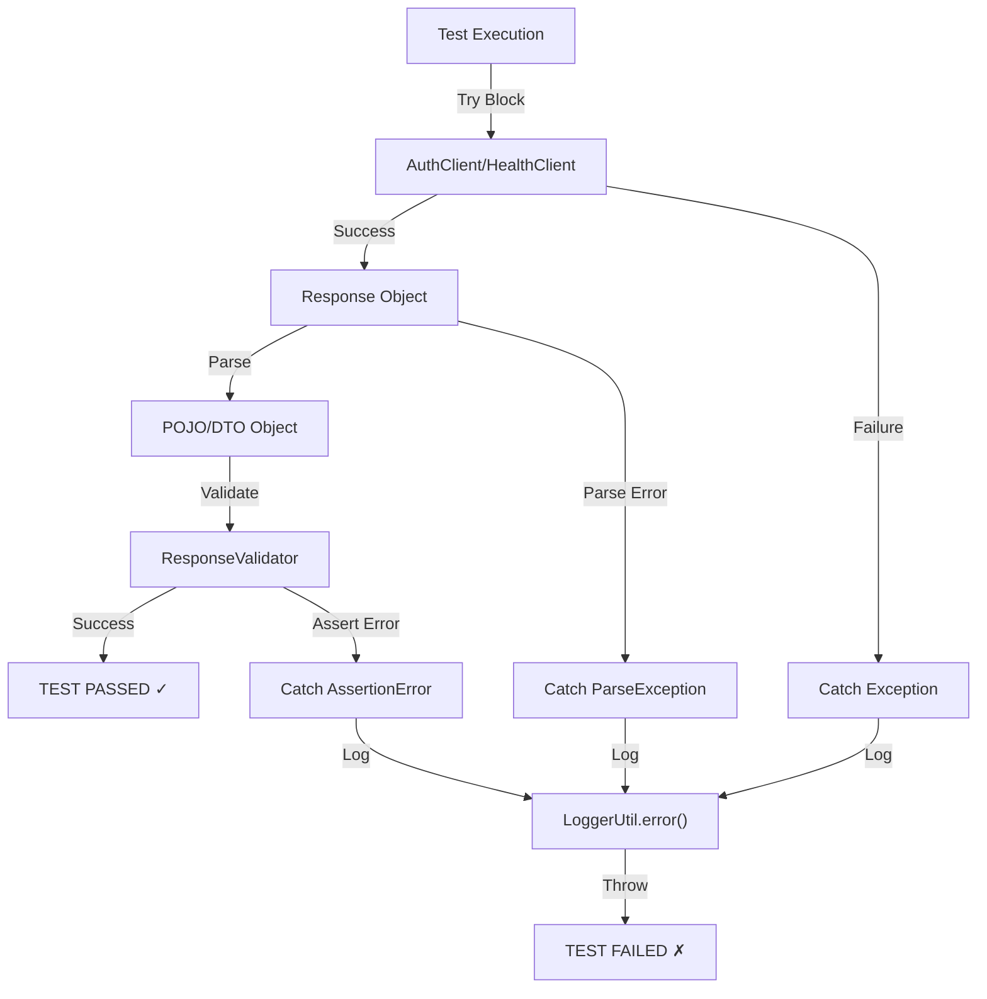
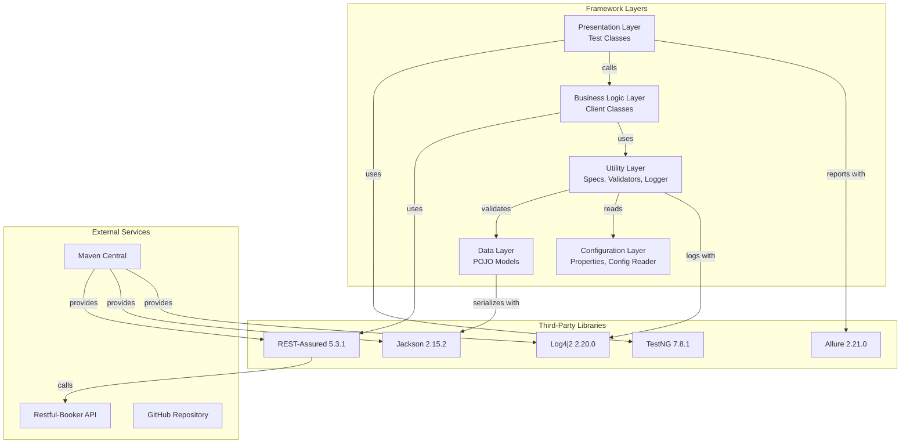

# REST-Assured API Framework - Architecture Diagrams

## 1. Layered Architecture

## 2. Component Interaction Flow

## 3. Multi-Environment Configuration Flow

## 4. Test Case Structure

## 5. Data Flow - Valid Authentication

## 6. Exception Handling Flow

## 7. Framework Dependencies

---

## Legend

- **✓** = Valid test case (expects success)
- **✗** = Invalid test case (expects error)
- **⏱** = Timeout test case (expects exception)
